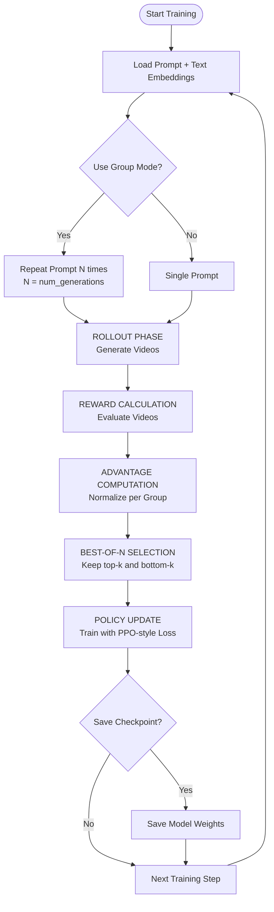
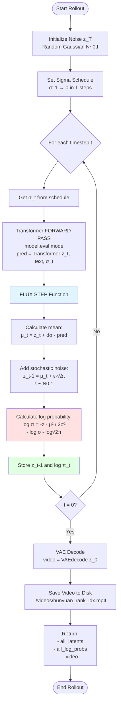
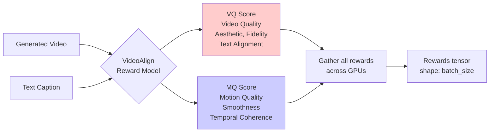
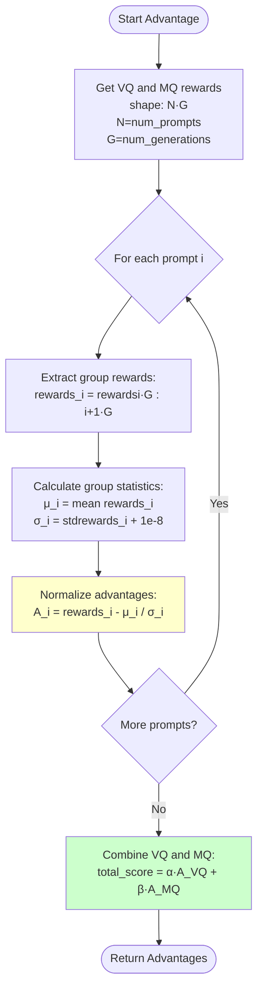
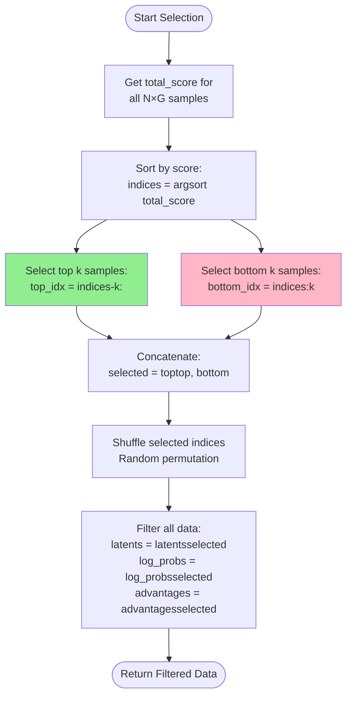
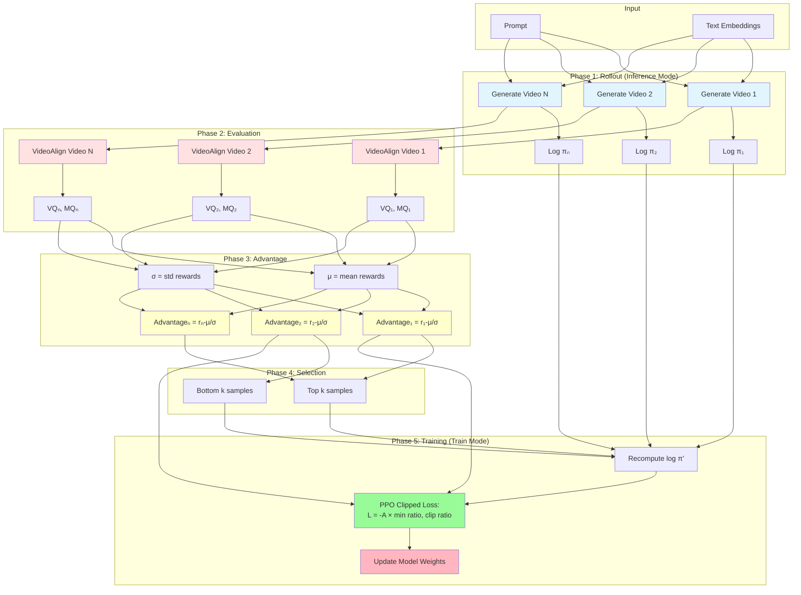

# GRPO for Video Models - Flow Diagram

## Main Training Loop



## Detailed Rollout Phase



## Reward Calculation (VideoAlign)



## Advantage Computation (Group Normalization)



## Best-of-N Selection



## Policy Update (PPO-style Training)

```mermaid
flowchart TD
    StartUpdate([Start Update]) --> Shuffle[Randomly shuffle timesteps<br/>for each sample]
    Shuffle --> SelectSteps[Select fraction of timesteps:<br/>num_train = T × timestep_fraction]
    
    SelectSteps --> LoopSamples{For each sample}
    LoopSamples --> LoopTime{For each selected<br/>timestep t}
    
    LoopTime --> Recompute[RECOMPUTE log prob<br/>model.train mode<br/>new_log_π = grpo_one_step...]
    
    Recompute --> CalcRatio[Calculate importance ratio:<br/>ratio = expnew_log_π - old_log_π]
    
    CalcRatio --> ClipAdv[Clip advantages:<br/>A = clampadv, -5, 5]
    
    ClipAdv --> CalcLossVQ[VQ Loss:<br/>L1 = -A_VQ · ratio<br/>L2 = -A_VQ · clamp ratio, 1-ε, 1+ε<br/>L_VQ = meanmax L1, L2]
    
    CalcLossVQ --> CalcLossMQ[MQ Loss:<br/>Similar clipped loss for MQ]
    
    CalcLossMQ --> CombineLoss[Combined Loss:<br/>L = α·L_VQ + β·L_MQ]
    CombineLoss --> Scale[Scale by:<br/>L = L / grad_accum × num_train]
    
    Scale --> Backward[L.backward<br/>Accumulate gradients]
    
    Backward --> CheckAccum{Accumulated<br/>enough?}
    CheckAccum -->|No| LoopTime
    CheckAccum -->|Yes| ClipGrad[Clip gradients:<br/>grad_norm = clip_gradmax_norm]
    
    ClipGrad --> OptStep[optimizer.step<br/>lr_scheduler.step<br/>optimizer.zero_grad]
    
    OptStep --> CheckMore{More samples?}
    CheckMore -->|Yes| LoopSamples
    CheckMore -->|No| EndUpdate([End Update])
    
    style CalcRatio fill:#FFE4B5
    style CombineLoss fill:#E6E6FA
    style Backward fill:#98FB98
```



## Complete GRPO Pipeline (High-Level)



## Key Equations

### Log Probability (Gaussian)
```
log π(z_{t-1} | z_t) = -||z_{t-1} - μ_t||² / (2σ_t²) - log(σ_t) - log(√(2π))

where:
  μ_t = z_t + dσ · model_output
  σ_t = η · √(Δt)
```

### Advantage (Group Normalization)
```
A_i = (r_i - μ_group) / (σ_group + ε)

where:
  μ_group = mean of rewards for same prompt
  σ_group = std of rewards for same prompt
```

### PPO Clipped Loss
```
L = mean(max(-A · ratio, -A · clip(ratio, 1-ε, 1+ε)))

where:
  ratio = exp(log π_new - log π_old)
  ε = clip_range (typically 1e-4)
```

### Combined Loss (Multi-Reward)
```
L_total = α · L_VQ + β · L_MQ

where:
  α = vq_coef (video quality coefficient)
  β = mq_coef (motion quality coefficient)
```

