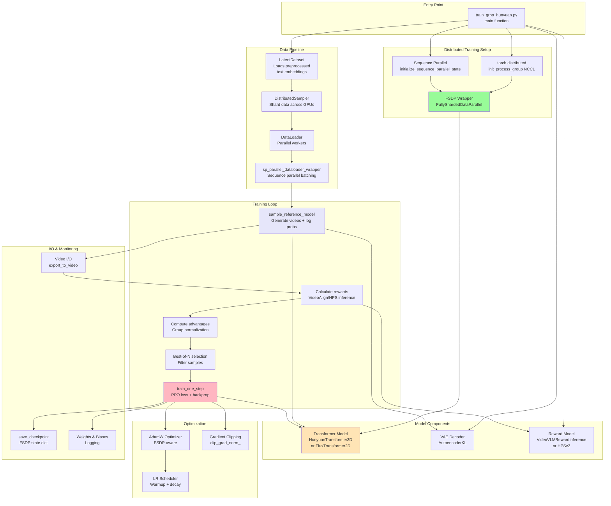
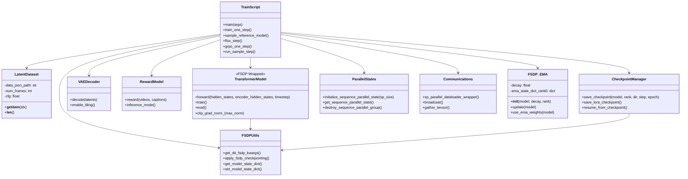
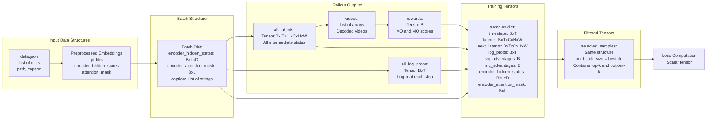
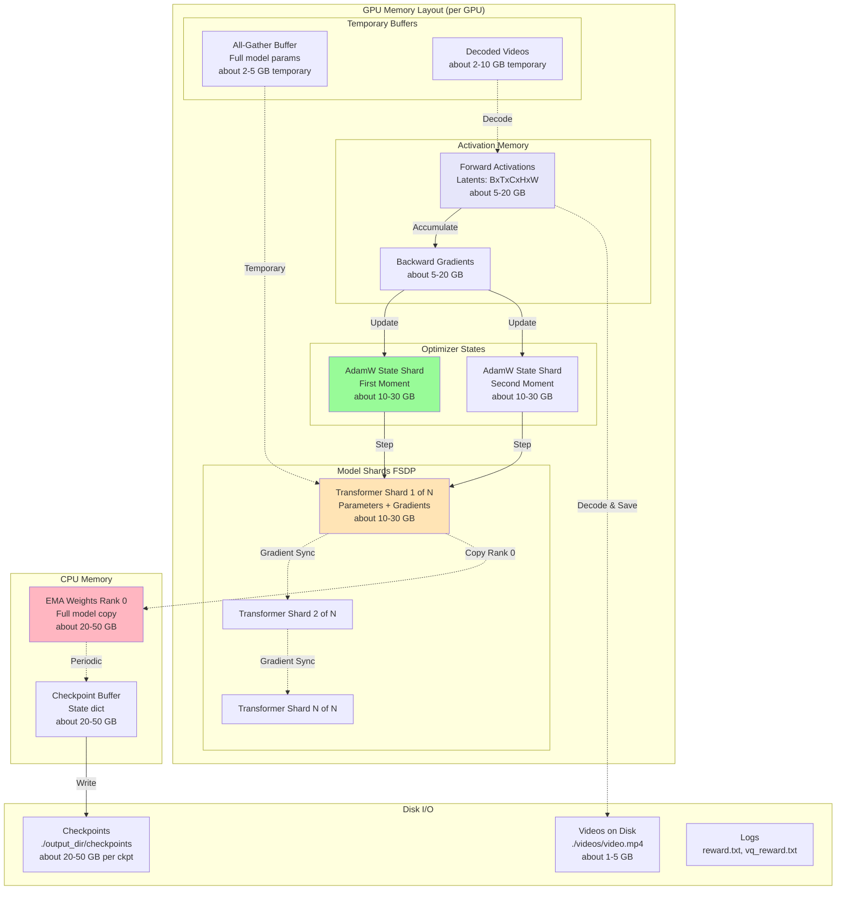
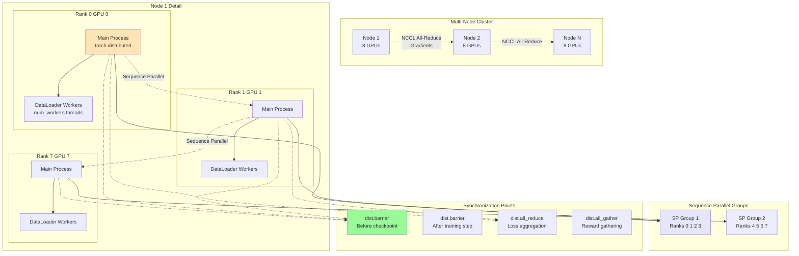
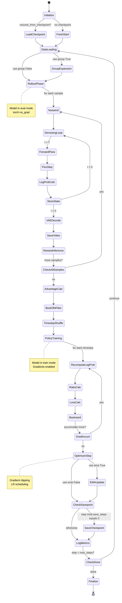
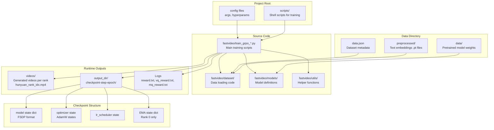
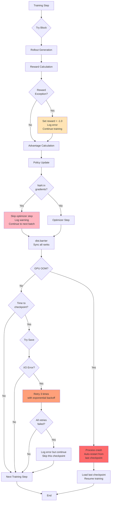

# GRPO Software Architecture - Engineering Perspective

## System Architecture Overview



## Class and Module Structure



## Data Structure Flow



## Memory Layout and Optimization



## Thread and Process Model



## Training Loop State Machine



## File System Organization



## Error Handling and Robustness



## Performance Optimization Patterns

```mermaid
graph TB
    subgraph "Memory Optimizations"
        GradCheckpoint[Gradient Checkpointing<br/>Trade compute for memory<br/>selective_checkpointing ratio]
        CPUOffload[CPU Offload<br/>use_cpu_offload flag<br/>Offload optimizer states]
        VAETiling[VAE Tiling<br/>vae.enable_tiling<br/>Decode in tiles]
        MixedPrecision[Mixed Precision<br/>torch.autocastbf16<br/>Reduce memory by 50%]
    end
    
    subgraph "Compute Optimizations"
        TF32[TF32 Matmul<br/>torch.backends.cuda.matmul.allow_tf32<br/>~8x speedup]
        FlashAttn[Flash Attention<br/>Memory-efficient attention<br/>O n instead of O n²]
        GradAccum[Gradient Accumulation<br/>Simulate larger batch size<br/>without OOM]
        TimestepFraction[Timestep Sampling<br/>timestep_fraction<br/>Train on subset of timesteps]
    end
    
    subgraph "I/O Optimizations"
        NumWorkers[DataLoader Workers<br/>dataloader_num_workers<br/>Parallel data loading]
        PinMemory[Pin Memory<br/>pin_memory=True<br/>Faster CPU→GPU transfer]
        Prefetch[Prefetch<br/>Preload next batch<br/>while training]
        AsyncIO[Async Video I/O<br/>Save videos in background]
    end
    
    subgraph "Distributed Optimizations"
        FSDP[FSDP Sharding<br/>Shard model + optimizer<br/>across GPUs]
        SeqParallel[Sequence Parallel<br/>Split temporal dimension<br/>across GPUs]
        NCCL[NCCL Communication<br/>Optimized GPU-GPU<br/>All-Reduce/All-Gather]
        OverlapComm[Overlap Compute & Comm<br/>Backward pass overlaps<br/>gradient sync]
    end
    
    subgraph "Algorithmic Optimizations"
        BestOfN[Best-of-N Filtering<br/>Train on top-k + bottom-k<br/>instead of all samples]
        GroupNorm[Group Normalization<br/>Per-prompt advantage<br/>Better learning signal]
        EarlyStopping[Early Stopping<br/>Stop if reward plateaus]
        SameNoise[Same Noise Init<br/>init_same_noise<br/>Reduce variance]
    end
    
    GradCheckpoint --> Memory[Reduce Peak Memory<br/>Enable larger models]
    CPUOffload --> Memory
    VAETiling --> Memory
    MixedPrecision --> Memory
    
    TF32 --> Speed[Increase Throughput<br/>More steps/sec]
    FlashAttn --> Speed
    GradAccum --> Speed
    TimestepFraction --> Speed
    
    NumWorkers --> Pipeline[Reduce Data Bottleneck]
    PinMemory --> Pipeline
    Prefetch --> Pipeline
    AsyncIO --> Pipeline
    
    FSDP --> Scale[Scale to Large Models<br/>Scale to Many GPUs]
    SeqParallel --> Scale
    NCCL --> Scale
    OverlapComm --> Scale
    
    BestOfN --> Sample[Improve Sample Efficiency<br/>Better reward signal]
    GroupNorm --> Sample
    EarlyStopping --> Sample
    SameNoise --> Sample
    
    style Memory fill:#FFE4B5
    style Speed fill:#98FB98
    style Pipeline fill:#E6E6FA
    style Scale fill:#FFB6C1
    style Sample fill:#FFA07A
```



## Key Configuration Parameters

```yaml
# Distributed Training
world_size: 16                      # Total GPUs
sp_size: 2                          # Sequence parallel group size
fsdp_sharding_strategy: "full"      # FSDP sharding mode

# Memory Management
use_cpu_offload: false              # Offload optimizer to CPU
gradient_checkpointing: true        # Enable gradient checkpointing
selective_checkpointing: 0.5        # Checkpoint 50% of layers
master_weight_type: "fp32"          # Master weights precision

# Training Hyperparameters
learning_rate: 1e-5                 # AdamW learning rate
weight_decay: 0.01                  # L2 regularization
max_grad_norm: 2.0                  # Gradient clipping threshold
gradient_accumulation_steps: 4      # Accumulate before update

# GRPO Specific
num_generations: 16                 # Videos per prompt
bestofn: 8                          # Keep top+bottom k
use_group: true                     # Group normalization
clip_range: 1e-4                    # PPO clipping epsilon
adv_clip_max: 5.0                   # Advantage clipping
timestep_fraction: 1.0              # Fraction of timesteps to train

# Video Generation
sampling_steps: 50                  # Denoising steps
h: 720                              # Video height
w: 1280                             # Video width
t: 49                               # Number of frames
fps: 24                             # Frames per second
eta: 1.0                            # SDE noise scale

# Reward Model
vq_coef: 1.0                        # Video quality coefficient
mq_coef: 1.0                        # Motion quality coefficient
use_videoalign: true                # Use VideoAlign reward

# I/O
dataloader_num_workers: 10          # DataLoader workers
checkpointing_steps: 20             # Save every N steps
max_train_steps: 200                # Total training steps

# EMA
use_ema: true                       # Enable EMA
ema_decay: 0.995                    # EMA decay rate
```

## Common Pitfalls and Solutions

| Pitfall | Symptom | Solution |
|---------|---------|----------|
| **OOM during rollout** | CUDA out of memory in generation phase | Reduce `num_generations`, enable `vae.enable_tiling()`, reduce `sampling_steps` |
| **OOM during training** | CUDA out of memory in backward pass | Increase `gradient_accumulation_steps`, enable `gradient_checkpointing`, use `cpu_offload` |
| **Slow data loading** | GPU idle waiting for data | Increase `dataloader_num_workers`, enable `pin_memory`, precompute embeddings |
| **Gradient explosion** | Loss becomes NaN | Reduce `learning_rate`, decrease `max_grad_norm`, check reward model outputs |
| **Reward collapse** | All rewards become similar | Use `init_same_noise=True`, increase `num_generations`, check reward model quality |
| **Slow convergence** | Reward doesn't improve | Increase `learning_rate`, reduce `clip_range`, increase batch size |
| **Checkpoint corruption** | Can't load checkpoint | Add checksum verification, retry logic with exponential backoff |
| **GPU hang** | Process freezes | Check NCCL timeout, add `dist.barrier()` debugging, verify network connectivity |
| **Memory leak** | Memory usage grows over time | Call `torch.cuda.empty_cache()`, check for circular references, profile with `torch.cuda.memory_summary()` |
| **Uneven GPU utilization** | Some GPUs idle | Balance data sharding, check sequence parallel split, verify FSDP strategy |

## Debugging Strategies

```python
# 1. Verify probability ratio
if step == 1 and local_rank == 0:
    print(f"Ratio at step 1: {ratio}")  # Should be ~1.0

# 2. Check gradient flow
for name, param in model.named_parameters():
    if param.grad is not None:
        print(f"{name}: grad_norm={param.grad.norm()}")

# 3. Monitor memory
print(f"Memory allocated: {torch.cuda.memory_allocated() / 1e9:.2f} GB")
print(f"Memory reserved: {torch.cuda.memory_reserved() / 1e9:.2f} GB")

# 4. Profile NCCL
os.environ["NCCL_DEBUG"] = "INFO"
os.environ["NCCL_DEBUG_SUBSYS"] = "ALL"

# 5. Check reward distribution
print(f"Rewards: min={rewards.min()}, max={rewards.max()}, mean={rewards.mean()}")
print(f"Advantages: min={advantages.min()}, max={advantages.max()}")

# 6. Validate data
assert not torch.isnan(latents).any(), "NaN in latents"
assert not torch.isinf(log_probs).any(), "Inf in log_probs"

# 7. Time profiling
import time
start = time.time()
# ... code block ...
print(f"Block took {time.time() - start:.2f}s")
```

